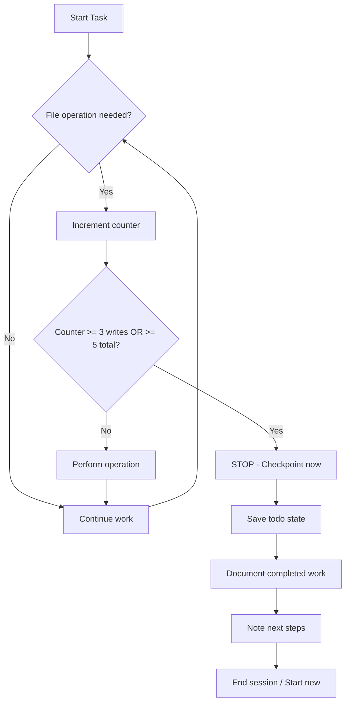

# Context Overflow Prevention Protocol for AI Coding Agents

## Root Cause (Corrected)

**NOT** time-based or "long sessions"  
**ACTUAL CAUSE:** File Read/Write operations dump full content to context without auto-compaction

| Operation Type | Tokens Added | Auto-Compacts? |
|----------------|--------------|----------------|
| User message   | ~50-100      | ✅ Yes         |
| AI response    | ~200-500     | ✅ Yes         |
| File Read      | ~1,500-2,000 | ❌ No          |
| File Write     | ~1,500-2,000 | ❌ No          |

**Math:** 6 file operations × 1,500 tokens = 9,000 tokens (danger zone)

---

## Core Rules

### Rule 1: Count Operations, Not Time

```
CHECKPOINT TRIGGERS:
├── After 3 Write operations → MANDATORY checkpoint
├── After 5 total file operations (Read + Write) → MANDATORY checkpoint
└── Before starting a new logical task group → RECOMMENDED checkpoint
```

### Rule 2: Atomic Task Batching

Break work into small batches that fit within 3-5 file operations:

```
❌ BAD: "Fix all 9 dialogue files"
✅ GOOD: "Fix dialogue files 1-2, checkpoint, then continue"
```

### Rule 3: Minimize Unnecessary Reads

```
❌ BAD: Read file to "check what's there" before deciding
✅ GOOD: Use glob/find first, only Read when you NEED the content
✅ GOOD: If you already know the file structure, Write directly
```

### Rule 4: Checkpoint Format

When checkpointing, save this state:

```markdown
## Session Checkpoint [timestamp]

### Completed:
- [x] Task 1 description
- [x] Task 2 description

### In Progress:
- [ ] Task 3 description (next step: ...)

### Files Modified This Session:
1. path/to/file1.tres - added emotion tags
2. path/to/file2.tres - created new

### Context for Next Session:
[Brief notes about what the next agent needs to know]
```

---

## Decision Flow



---

## Practical Example

### BAD Approach (causes overflow):
```
Turn 1: Read file1.tres, Read file2.tres, Read file3.tres
Turn 2: Write file1.tres, Write file2.tres  
Turn 3: Read file4.tres, Write file3.tres ← CRASH
```

### GOOD Approach (prevents overflow):
```
Session 1:
  Turn 1: Read file1.tres, Write file1.tres
  Turn 2: Read file2.tres, Write file2.tres
  Turn 3: CHECKPOINT (4 operations reached)

Session 2:
  Turn 1: Read file3.tres, Write file3.tres
  Turn 2: Read file4.tres, Write file4.tres
  Turn 3: CHECKPOINT
```

---

## Recovery If Overflow Happens

1. **Don't panic** - work is saved in files already written
2. Start new session
3. Use `git status` or file timestamps to see what was completed
4. Update todo list based on actual file state
5. Continue from last completed task

---

## Todo Management Across Sessions

### Before Each Session:
```bash
# Check current state
git status
ls -la path/to/dialogue/files/
```

### During Session:
- Mark todos complete IMMEDIATELY after each file write
- Don't batch todo updates

### End of Session:
- Export remaining todos clearly
- Note exact next step (not just "continue")

---

## Quick Reference Card

```
┌─────────────────────────────────────────────────┐
│  CONTEXT OVERFLOW PREVENTION - QUICK RULES      │
├─────────────────────────────────────────────────┤
│  ⚠️  CHECKPOINT after 3 Writes                  │
│  ⚠️  CHECKPOINT after 5 total file ops          │
│  ✅  Batch tasks: 2-3 files per session         │
│  ✅  Mark todos done IMMEDIATELY                │
│  ❌  Don't Read "just to check"                 │
│  ❌  Don't trust time-based checkpoints         │
└─────────────────────────────────────────────────┘
```
